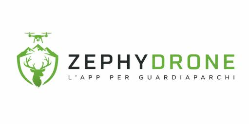
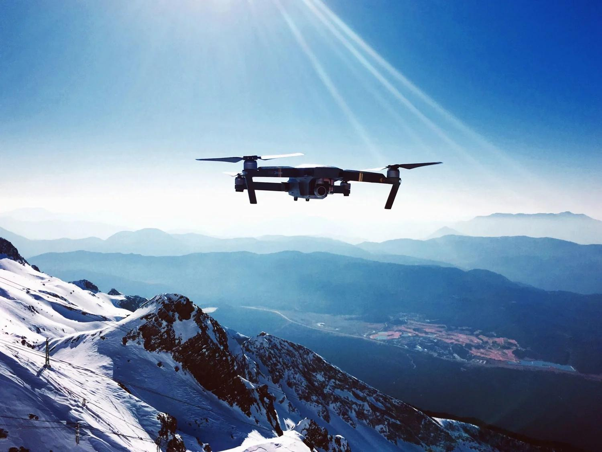
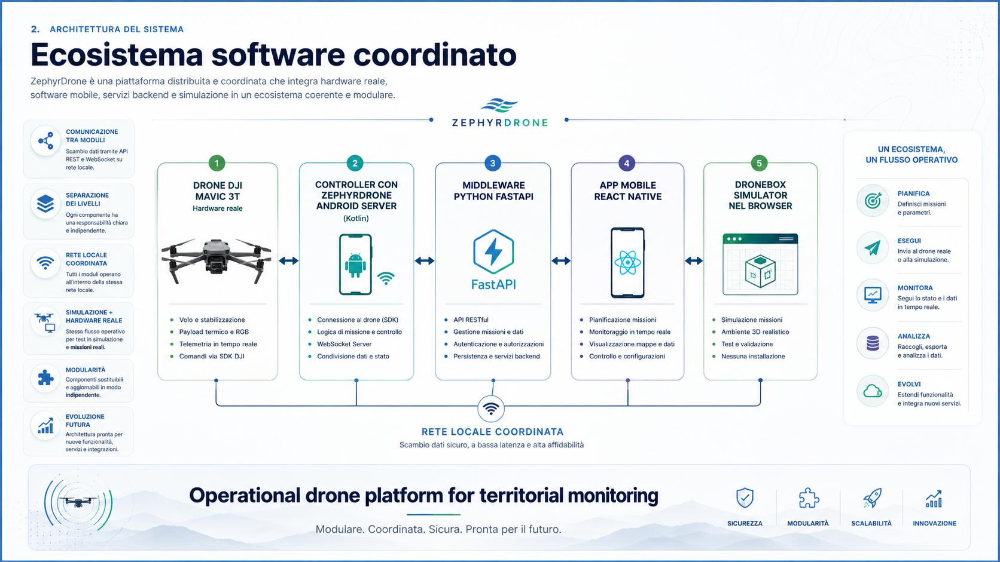
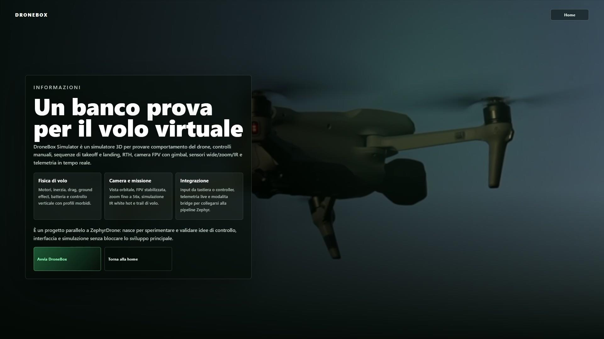
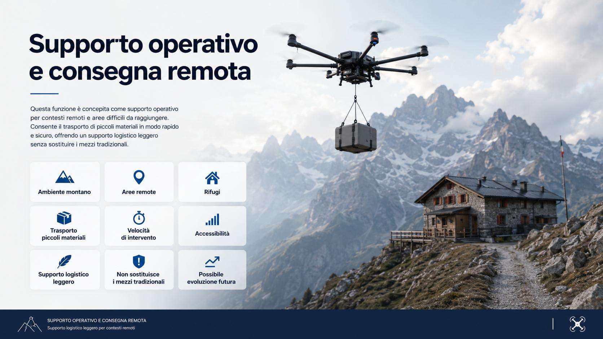
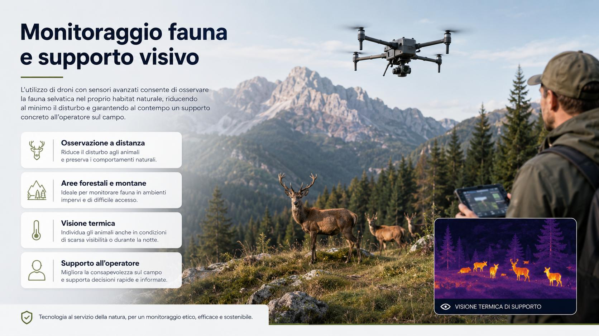

# ZephyrDrone

Piattaforma operativa per monitoraggio territoriale, missioni automatiche e supporto all'operatore.



ZephyrDrone e un progetto scolastico sviluppato in ambito PCTO / GPOI presso ITIS Delpozzo Cuneo. L'obiettivo e costruire un ecosistema software coordinato per supportare guardiaparchi, operatori ambientali e protezione civile in attivita di sopralluogo, monitoraggio del territorio, raccolta dati e osservazione di aree difficili da raggiungere.

Il progetto non e pensato come una singola applicazione isolata, ma come una piattaforma modulare composta da piu servizi: server Android in Kotlin sul controller del drone, middleware Python FastAPI, applicazione mobile React Native e simulatore browser DroneBox Simulator.

## Indice

- [Contesto](#contesto)
- [Obiettivi](#obiettivi)
- [Funzionalita principali](#funzionalita-principali)
- [Architettura](#architettura)
- [Moduli software](#moduli-software)
- [Hardware e compatibilita](#hardware-e-compatibilita)
- [Avvio del sistema](#avvio-del-sistema)
- [DroneBox Simulator](#dronebox-simulator)
- [Scenari operativi](#scenari-operativi)
- [Valore didattico](#valore-didattico)
- [Sviluppi futuri](#sviluppi-futuri)
- [Autori](#autori)

## Contesto

ZephyrDrone nasce per simulare e progettare una piattaforma realmente utilizzabile in contesti ambientali e territoriali. Il caso d'uso principale riguarda l'impiego di un drone in aree naturali, montane o difficili da raggiungere, dove e utile osservare rapidamente il territorio, raccogliere immagini e supportare operatori sul campo.



Il drone di riferimento e il DJI Mavic 3T Enterprise fornito dalla scuola. La compatibilita e stata pensata principalmente su questa piattaforma; eventuali altri droni della linea DJI Mavic Enterprise sono da considerare come compatibilita ipotetica e da verificare.

## Obiettivi

ZephyrDrone ha lo scopo di fornire un ambiente completo per:

- pianificare missioni automatiche con waypoint e punti di interesse;
- visualizzare telemetria, stato del drone e posizione su mappa;
- ricevere video live durante le operazioni;
- raccogliere foto, video e dati utili alla documentazione tecnica;
- supportare sopralluoghi ambientali e monitoraggio di aree protette;
- sperimentare logiche di missione anche tramite simulatore;
- separare i moduli software in modo ordinato, mantenendo una comunicazione coordinata in rete locale.

## Funzionalita principali

### Missioni automatiche

Il sistema permette di organizzare missioni tramite waypoint, cioe punti di passaggio predefiniti, e POI, cioe punti di interesse geografico salvabili e richiamabili. Una missione puo includere quota, traiettoria, fermate, orientamento del gimbal e azioni automatiche come lo scatto di fotografie.

Questa logica rende possibile ripetere sopralluoghi in modo coerente, confrontabile e documentabile nel tempo.

### Live feed e telemetria

Durante l'utilizzo operativo l'utente puo visualizzare:

- video live dal drone;
- stato della missione;
- batteria;
- altitudine;
- velocita;
- livello GPS;
- posizione su mappa satellitare;
- informazioni di rete e connessione.

La combinazione tra video, mappa e telemetria aiuta l'operatore a mantenere consapevolezza della situazione durante la missione.

### Foto e registrazione

ZephyrDrone integra funzioni di scatto foto e registrazione. In modalita automatica il drone puo fermarsi in punti specifici e raccogliere immagini secondo una logica pianificata.

Questo permette di usare il sistema non solo per il volo, ma anche per la produzione di materiale utile ad analisi successive, verifiche e documentazione.

### Controllo manuale e occupazione del drone

Quando necessario, l'operatore puo passare al controllo manuale tramite il controller del drone. Il sistema include anche una logica di occupazione del drone, utile per evitare accessi concorrenti: un solo client assume il controllo operativo, mentre gli altri moduli rimangono in ascolto senza interferire.

## Architettura



L'architettura di ZephyrDrone e distribuita ma coordinata. Ogni modulo ha una responsabilita precisa e comunica con gli altri tramite rete locale.

Flusso generale dei dati:

```text
Drone DJI Mavic 3T
        |
        v
Controller DJI con Android Server Kotlin
        |
        v
Middleware Python FastAPI
        |
        v
App mobile React Native
        |
        v
Operatore
```

A questa catena si aggiunge DroneBox Simulator, un ambiente browser in Three.js usato per test, sviluppo e sperimentazione.

## Moduli software

### ZephyrDrone Android Server

Server sviluppato in Kotlin e installato sul controller Android del drone. E il punto di contatto piu vicino all'hardware reale e dialoga con l'SDK DJI.

Responsabilita principali:

- rilevamento del drone;
- lettura di batteria e stato;
- esposizione dei dati di rete;
- gestione di funzioni di missione;
- supporto a foto, controllo e telemetria;
- visualizzazione del modello del drone collegato;
- avvio del server locale dal controller.

### Middleware Python FastAPI

Backend intermedio basato su FastAPI. Coordina la comunicazione tra server Android, applicazione mobile e strumenti di sviluppo.

Responsabilita principali:

- centralizzazione della configurazione;
- esposizione di endpoint API;
- gestione dei servizi di supporto;
- dashboard di test e sviluppo;
- pagina settings per modificare la configurazione di rete;
- ponte tra controller, app e servizi interni.

### App mobile React Native

Applicazione operativa per l'utente sul campo. Se si trova nella stessa rete locale del middleware, prova a rilevare automaticamente il server nelle classi di IP privati.

Funzioni previste:

- connessione al middleware;
- occupazione del drone;
- visualizzazione della livestream;
- picture-in-picture del video;
- telemetria;
- mappa operativa;
- preset di missione;
- funzioni camera;
- controlli rapidi.

### DroneBox Simulator

Simulatore browser sviluppato in Three.js. Puo essere utilizzato come progetto parallelo, integrabile con ZephyrDrone oppure in modalita standalone.

Funzioni principali:

- simulazione del comportamento del drone;
- fisica realistica di base;
- controllori PID;
- ambiente di test per missioni;
- prova di interfacce e logiche operative;
- allenamento senza utilizzo dell'hardware reale.

## Hardware e compatibilita

| Componente | Descrizione |
| --- | --- |
| Drone di riferimento | DJI Mavic 3T Enterprise |
| Compatibilita testata | DJI Mavic 3T Enterprise |
| Compatibilita ipotetica | Altri droni DJI Mavic Enterprise |
| Controller consigliato | DJI RC Pro Enterprise o controller DJI compatibile con Android |
| Rete | Tutti i dispositivi devono trovarsi nella stessa sottorete locale |

## Avvio del sistema

### 1. Preparazione del controller

1. Installare l'APK ZephyrDrone Android Server sul controller DJI.
2. Accendere drone e controller.
3. Attendere che il drone completi inizializzazione, collegamento e calibrazione.
4. Aprire ZephyrDrone Android Server.
5. Avviare il server tramite il pulsante centrale.
6. Verificare che compaiano modello del drone, batteria, stato e dati di rete.

### 2. Riconoscimento del drone

Se il drone viene mostrato come `UNRECOGNIZED`, chiudere l'app e riavviare il server. Di solito il problema e causato da un avvio troppo rapido del server, prima che il drone abbia completato la fase di inizializzazione.

Dopo il riavvio, il modello dovrebbe comparire correttamente, ad esempio come `MAVIC3_ENTERPRISE`.

### 3. Avvio del middleware

Nel file `network_settings.json` impostare l'indirizzo IP del server Android, recuperabile dalla sezione network del server Kotlin.

In alternativa, dopo l'avvio del middleware, usare la pagina:

```text
/settings
```

per modificare la configurazione tramite dashboard grafica.

### 4. Dashboard di sviluppo

Il middleware espone anche:

```text
/dashboard
```

Questa dashboard e pensata per sviluppo, test e visualizzazione della posizione del drone in 3D. Non rappresenta l'interfaccia principale per l'uso operativo.

### 5. Avvio dell'app mobile

1. Collegare il dispositivo mobile alla stessa rete locale del middleware.
2. Aprire l'app React Native.
3. Attendere il rilevamento automatico del server.
4. Occupare il drone per evitare accessi concorrenti.
5. Usare livestream, telemetria, mappa e funzioni operative.

## DroneBox Simulator



DroneBox Simulator e stato progettato come banco prova virtuale per il volo. Permette di sperimentare missioni, controlli e interfacce senza dipendere sempre dal drone reale.

Dal punto di vista didattico e utile per:

- osservare dinamiche di volo;
- studiare il comportamento dei controllori PID;
- testare missioni in sicurezza;
- validare idee prima dell'utilizzo su hardware reale;
- rendere il progetto piu completo anche quando il drone non e disponibile.

Per limitazioni legate all'SDK e all'hardware DJI, il collegamento reale a ZephyrDrone richiede comunque il drone fisico quando si vuole interagire con la piattaforma DJI.

## Scenari operativi

### Monitoraggio territoriale

ZephyrDrone puo supportare il controllo di sentieri, boschi, corsi d'acqua e aree naturali protette. L'uso combinato di mappa, telemetria e video consente una visione piu completa del territorio.

### Supporto operativo e consegna remota



In ambiente montano o in aree isolate, il drone puo essere immaginato come supporto logistico leggero. Non sostituisce mezzi terrestri, elicotteri o trasporti strutturati, ma puo ridurre tempi e difficolta quando serve inviare piccoli materiali in modo rapido e mirato.

Esempi di utilizzo:

- rifugi;
- aree remote;
- postazioni difficili da raggiungere;
- trasporto di piccoli materiali tecnici;
- supporto a operatori sul campo.

### Monitoraggio fauna



L'impiego del drone puo aiutare l'osservazione della fauna in boschi, aree montane e contesti naturali. L'osservazione a distanza riduce il disturbo agli animali e permette di controllare zone ampie in tempi ridotti.

La visione termica del DJI Mavic 3T puo supportare l'individuazione di animali in condizioni di scarsa visibilita, in aree ombreggiate o in orari critici. Le camere wide e zoom restano utili per osservare il contesto generale e analizzare dettagli a distanza.

## Valore didattico

ZephyrDrone integra piu ambiti dello sviluppo software:

- sviluppo Android in Kotlin;
- backend Python con FastAPI;
- sviluppo mobile con React Native;
- networking in rete locale;
- integrazione con hardware reale;
- telemetria e controllo operativo;
- simulazione browser con Three.js;
- progettazione modulare di un ecosistema software.

Il progetto permette quindi di affrontare un caso realistico in cui frontend, backend, mobile, hardware e simulazione devono lavorare insieme in modo coerente.

## Sviluppi futuri

Possibili evoluzioni del progetto:

- miglioramento della pianificazione missioni;
- gestione avanzata di waypoint e POI;
- integrazione piu completa del live feed;
- salvataggio strutturato di foto, video e log;
- sincronizzazione con database esterni;
- compatibilita verificata con altri droni DJI Enterprise;
- miglioramento del simulatore DroneBox;
- maggiore integrazione tra simulatore e mission planner reale;
- dashboard operative piu complete per enti ambientali e protezione civile.

## Stato del progetto

Progetto scolastico in fase di sviluppo e sperimentazione.

La piattaforma e pensata come prototipo tecnico e didattico. Alcune funzioni dipendono dalla disponibilita del drone reale, dal controller DJI, dalla rete locale e dalle limitazioni dell'SDK DJI.

## Autori

Progetto sviluppato da:

- Giuseppe Leonardi Rovetto
- Cani Gabriel

Gruppo progetto: Astronauti Del Kebab

Istituto: ITIS Delpozzo Cuneo  
Classe: 5B Informatica  
Anno scolastico: 2025/2026  
Ambito: PCTO / GPOI

## Licenza

Licenza non ancora specificata.
